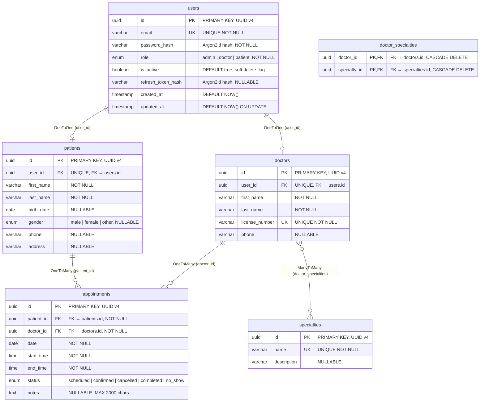

# Diagrama Entidad-Relación — Clinic API

Basado en las entidades TypeORM del proyecto (`user.entity.ts`, `patient.entity.ts`, `doctor.entity.ts`, `specialty.entity.ts`, `appointment.entity.ts`) y las migraciones (`1776681637179-InitialSchema.ts`, `1776700000000-AddRefreshTokenToUser.ts`).

---

## Notas sobre las relaciones

| Relación | Cardinalidad | Columna FK | ON DELETE |
|----------|-------------|------------|-----------|
| `users` → `patients` | 1:1 (opcionales) | `patients.user_id` | NO ACTION |
| `users` → `doctors` | 1:1 (opcionales) | `doctors.user_id` | NO ACTION |
| `patients` → `appointments` | 1:N | `appointments.patient_id` | NO ACTION |
| `doctors` → `appointments` | 1:N | `appointments.doctor_id` | NO ACTION |
| `doctors` ↔ `specialties` | N:M | `doctor_specialties` (tabla intermedia) | CASCADE |

### Soft delete

La eliminación lógica se implementa mediante la columna `users.is_active`. No existe una columna `deleted_at` de TypeORM (`@DeleteDateColumn`); el soft delete se gestiona manualmente en los servicios estableciendo `is_active = false`. Los queries de lectura usan `INNER JOIN` sobre `users` para filtrar automáticamente los registros inactivos.

### Enums en base de datos

Los enums se almacenan como `varchar` / tipo nativo de PostgreSQL según la configuración de TypeORM:

- `users.role`: `admin`, `doctor`, `patient`
- `patients.gender`: `male`, `female`, `other`
- `appointments.status`: `scheduled`, `confirmed`, `cancelled`, `completed`, `no_show`

### Tabla intermedia `doctor_specialties`

Es una tabla pura de unión (sin columnas adicionales) generada por TypeORM para la relación `@ManyToMany` entre `Doctor` y `Specialty`. Ambas FKs son `PRIMARY KEY` compuesto con `ON DELETE CASCADE`.
