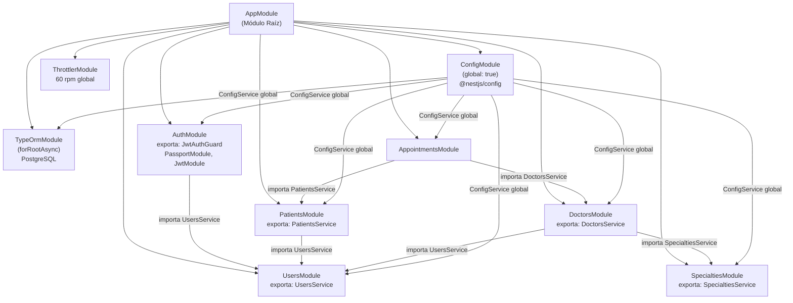
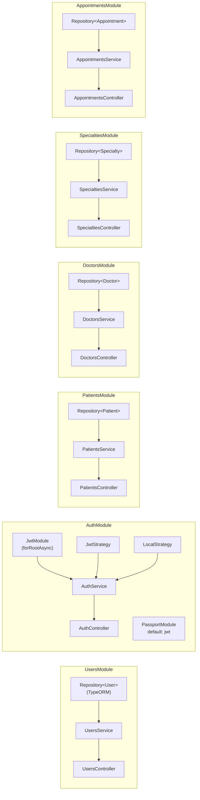
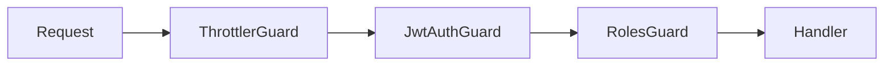

# Mapa de Módulos — Clinic API

Diagrama de dependencias entre todos los módulos NestJS del proyecto, incluyendo qué providers exporta cada uno y qué módulos los consumen.

---

## Providers registrados por módulo

---

## Guards globales (APP_GUARD)

Los siguientes guards se registran en `AppModule` como `APP_GUARD` y se ejecutan en este orden en cada request:

| Guard | Módulo origen | Rol |
|-------|--------------|-----|
| `ThrottlerGuard` | `ThrottlerModule` | Rate limiting por IP |
| `JwtAuthGuard` | `AuthModule` / `common/guards` | Valida Bearer token; respeta `@Public()` |
| `RolesGuard` | `common/guards` | Verifica `@Roles()` contra `req.user.role` |
