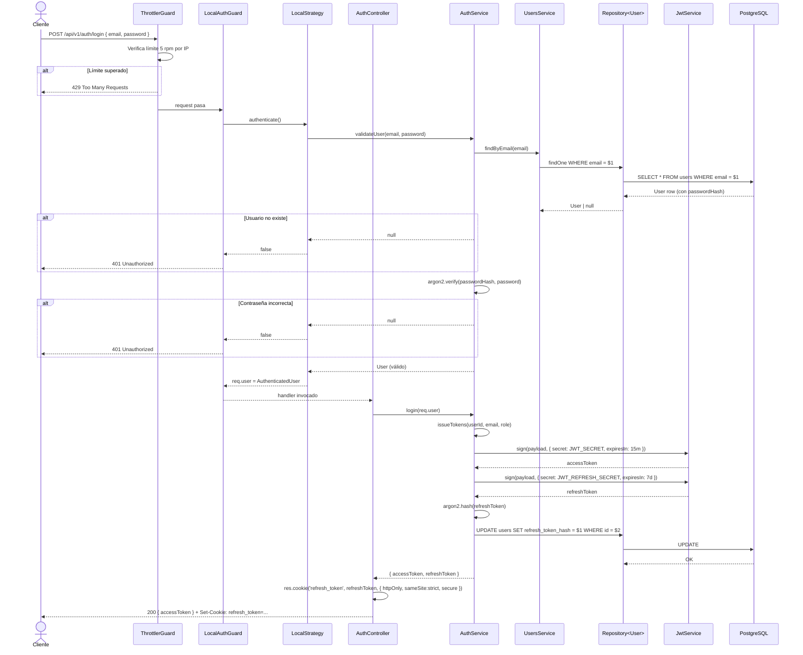
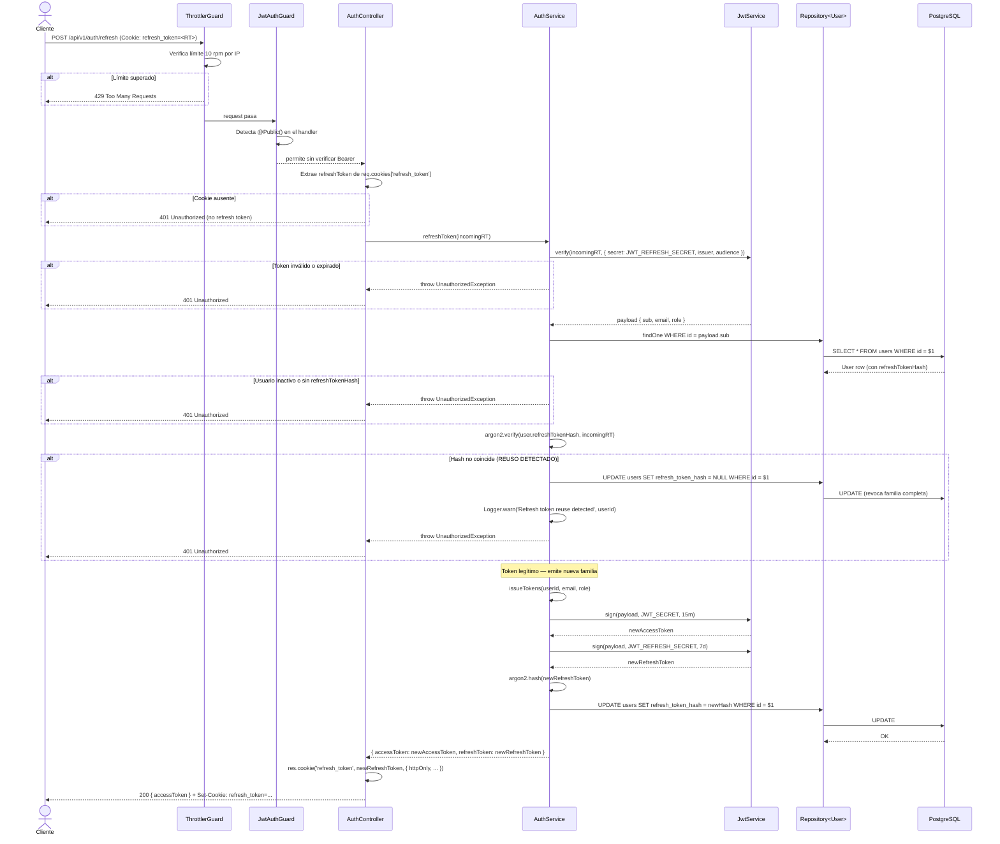
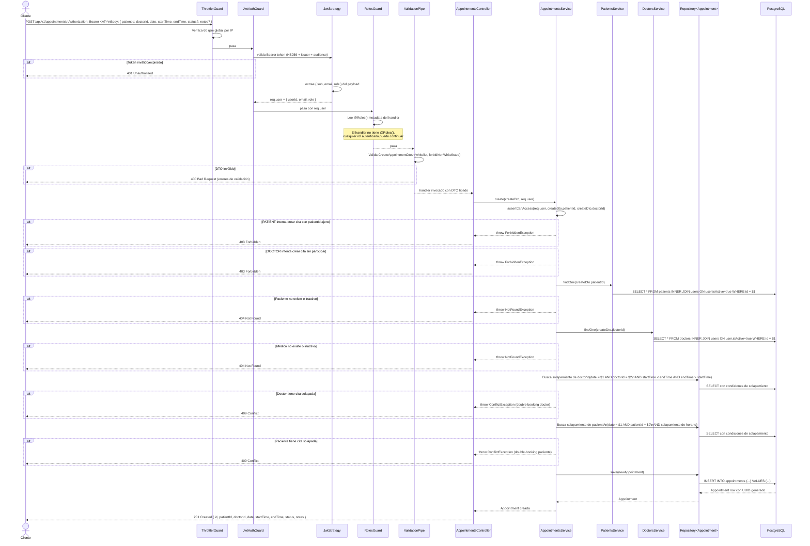

# Diagramas de Secuencia — Clinic API

Los tres flujos más críticos de la API son:

1. **Login con emisión de tokens** — el punto de entrada de toda sesión autenticada
2. **Refresco de token con detección de reuso** — el mecanismo de seguridad más sofisticado del sistema
3. **Creación de cita médica con validaciones de negocio** — el flujo de dominio central

---

## Flujo 1: Autenticación (POST /api/v1/auth/login)

---

## Flujo 2: Refresco de token (POST /api/v1/auth/refresh)

Este flujo implementa **refresh token rotation** con detección de reuso: si el hash almacenado no coincide con el token recibido, se revoca toda la familia (logout forzado).

---

## Flujo 3: Creación de cita médica (POST /api/v1/appointments)

Este flujo concentra las validaciones más complejas: autenticación, RBAC, ownership del patientId, validación del doctorId y prevención de double-booking.

